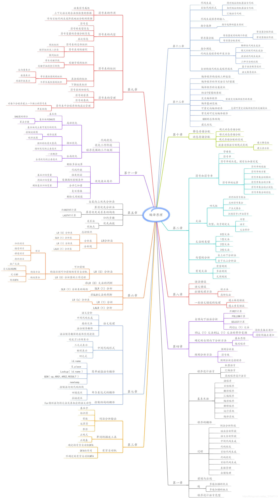

介绍编译程序构造的一般原理和基本方法

语言和文法、词法分析、语法分析、[语法制导翻译](https://baike.baidu.com/item/语法制导翻译)、中间代码生成、[存储管理](https://baike.baidu.com/item/存储管理/9827115)、代码优化和目标代码生成

计算机专业课程中最难及最挑战学习能力的课程之一。

编译原理课程内容主要是原理性质，高度抽象

1. 遍 结构清晰
2. 编译程序时间 管理表格
3. 词法分析器输出结果  ：单词的种别编码，自身值
4. 正归式：语言集相等
5. 中间代 码生成依据 语义规则
6. 静态储存 空间 运行前
7. 堆式 任意分配

1. DFA,LR控制器：总控制程序,分析表；流程图 DAG，三元式：间接编码，四元式：临时变量
2. 简述
3. 文法，优先级
4. 文法G,NFA DFA LL文法

1. 编译部分，词法分析，语法分析，中间代码	生成，...优化：删除多余运算，无用赋值，目标代码生成
2. 词法分析 单词 正则 工具：语法树
3. 词法分析器：扫描器 词法错误
4. 解释程序，不生产 目标代码：地址分配
5. 解释程序：代码先中间在执行 语义规则
6. 分析，单词，语句，结构
7. 编译程序 = 解释程序
8. G 终结符号 句子
9. 文法 4🛎（0-3）3 正则 2上下文无关 1xxx 0短文文法
10. 上下文无关文法G：4个部分 1.xx2.xx3.开始4. 产生式 无限级递归

1. 编译部分：表格处理，出错处理
2. 编译，解释，产生目标代码
3. 编译程序 ：原程序-》目标程序 高级语言的翻译
4. 产生式 语法成分 语法范畴
5. 语法分析，自上而下：移进，递归，错误处理，接受|消除回朔，自下而上 语法规则  输入：单词符号串；输出：语法单位
6. 名字：符号类型，作用域
7. 高级程序：解释，编译

1. 句子，语言
2. 集合
3. 句型 句柄  可归约串
4. 文法 语义规则 规则定义形式
5. 语义分析阶段：逆波兰式，三元式，四元式
6. 局部优化：基本块
7. 语义分析基本功能